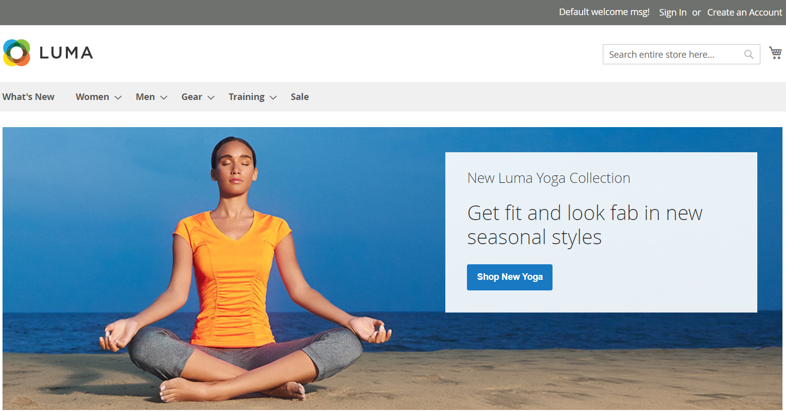

# TypeScript Cypress First Demo project with Reporting
### Tests are written for [Demo automation web-site called "Luma" Store](https://magento.softwaretestingboard.com/).


## What you need to have to be able to run these tests:
- NodeJs;
- VS Code;
- Chrome Browser.

### Tests exist in cypress -> e2e

## Useful commands in terminal:
### - to open cypress:
```
npm run cypress:open
```

### - to run tests and create report:
```
npm run dev:test
```

## If you are not familiar with Cypress tests, you need to do these steps:
- clone this project;
- check your NodeJs version by this command in terminal: 
```
node --version
```
Your version and project's version have to be compatible.
- a command to install Cypress:
```
npm install cypress --save-dev
```
- a command to install Typescript:
```
npm install --save-dev typescript
```
- a command to install faker dependency:
```
npm install @faker-js/faker --save-dev
```


### Useful links:
* [Cypress Installation for Test Automation: Tutorial](https://www.browserstack.com/guide/cypress-installation-for-test-automation)
* [TypeScript for Cypress](https://docs.cypress.io/guides/tooling/typescript-support)
* [Faker: Getting Started](https://fakerjs.dev/guide/)